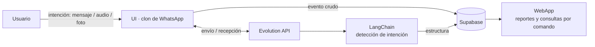

# Huella

> El trabajo que ya pasa por WhatsApp, convertido en memoria, coordinación e impacto reportable.

Plataforma conversacional para ONGs que usa **WhatsApp como canal principal de captura**. En lugar de pedir que los equipos adopten una herramienta nueva, captura el trabajo donde ya ocurre —mensajes, audios, fotos— y lo transforma en tareas, decisiones, actividades y evidencia de impacto.

Proyecto desarrollado para **Halketon**, la hackathon social de Paisanos y Crecimiento Build (junio 2026).

## El problema

16 ONGs argentinas entrevistadas coinciden en lo mismo: adoptan herramientas (Asana, Notion, Trello, Slack) y terminan volviendo a WhatsApp. Los plazos se pierden, las actividades no se registran y, cuando un financiador pide evidencia de impacto, hay que reconstruir todo a mano desde chats, planillas y memoria.

## La solución

Huella no reemplaza herramientas: captura lo que ya pasa por WhatsApp y lo estructura.

1. El usuario expresa una intención por WhatsApp —*"Hoy taller en Ludueña, vinieron 22 chicos, faltó material"*—; la **UI** (clon de WhatsApp) la representa e interactúa con Evolution API.
2. LangChain detecta la intención sobre el mensaje recibido.
3. Se guarda **primero el evento crudo** en Supabase, después se estructura.
4. Queda disponible en la **WebApp** para consulta: una tarea con responsable (coordinación) **y** una actividad registrada (impacto). Un mensaje, dos salidas.

## Tracks

- **Track 1 — Coordinación y memoria interna:** tareas, responsables, vencimientos, decisiones.
- **Track 3 — Impacto y reportes:** actividades, beneficiarios, evidencia, reportes.
- **Track 2 — Donantes (roadmap):** los reportes de impacto alimentan, más adelante, campañas y comunicación con donantes.

## Principios de diseño

- **Capturar primero, estructurar después.** Nada se pierde si la IA falla o el mensaje es ambiguo: el evento crudo siempre queda guardado.
- **Resiliencia offline.** No exige conectividad perfecta. Distingue *fecha del hecho* de *fecha de recepción*; los mensajes que llegan tarde se procesan como registro diferido.
- **Dato sensible separado.** La información individual (PII) vive en una base restringida; los reportes solo usan métricas agregadas. Diseñado para cumplir con la Ley 25.326 y principios de ISO 27001.
- **Multi-tenant.** Cada ONG es un workspace aislado (RLS por organización en Supabase).

## Arquitectura

| Componente | Tecnología | Rol |
|---|---|---|
| Canal | WhatsApp + Evolution API | Entrada/salida de mensajes |
| Inbox | Chatwoot | Bandeja omnicanal |
| Inteligencia | LangChain | Detección de intención y extracción |
| Datos | Supabase (Postgres) | Persistencia compartida + auth + realtime |
| UI | React (Vite) | Representa la intención del usuario (clon de WhatsApp); escribe eventos y habla con Evolution API |
| WebApp | React / web | Motor de almacenamiento/gestión sobre Supabase; vista opcional de reportes y consultas por comando |

La integración entre piezas es la **base de Supabase**: el esquema de tablas es el contrato del equipo. El modelo de datos está documentado en [`docs/model/bd.md`](./docs/model/bd.md).

## Componentes

Trabajamos en repos separados, integrados a través de la base compartida de Supabase:

- **`huella`** (este repo) — UI (clon de WhatsApp): representa la intención del usuario, escribe eventos e interactúa con Evolution API. Incluye la documentación del proyecto.
- **WebApp** — motor de almacenamiento/gestión sobre Supabase; vista opcional de reportes y consultas internas por comando.
- **API de intención** — LangChain (repo aparte).
- **Infra** — Evolution API + Chatwoot vía Docker (repo aparte).
- **Supabase** — instancia hosted compartida.

## Estado

Hackathon MVP en desarrollo. Foco de la demo: captura desde WhatsApp → workspace actualizándose en vivo.

## Equipo

JPGallegos1 y equipo — Halketon 2026.
