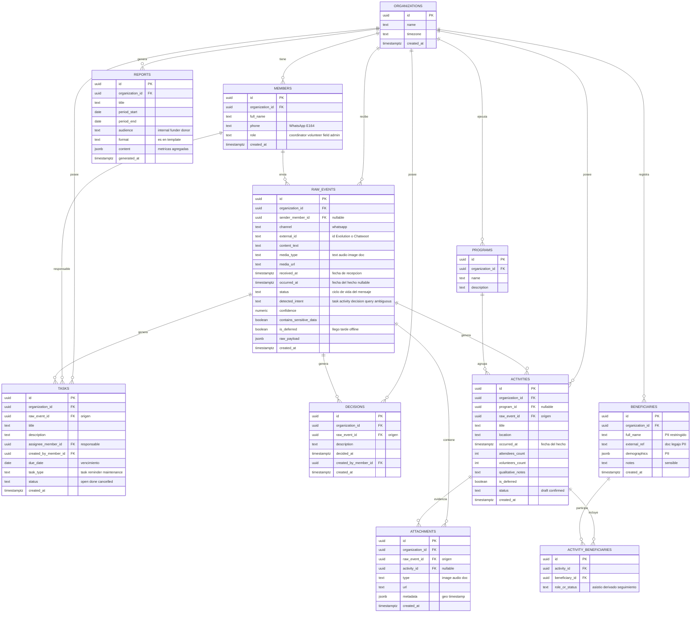

# Modelo de datos — Huella

El esquema de Supabase es el **contrato de integración del equipo**: todas las piezas (UI, WebApp, API de intención) leen y escriben sobre estas mismas tablas. Este documento es la fuente de verdad del modelo.

## Convenciones

- Toda tabla usa `uuid` como PK y `organization_id` como FK para aislamiento multi-tenant (RLS por organización en Supabase).
- Timestamps en `timestamptz`.
- `raw_events` es la captura cruda; `tasks`, `decisions` y `activities` referencian su `raw_event_id` de origen (trazabilidad: *capturar primero, estructurar después*).
- El dato sensible (PII) queda aislado en `beneficiaries`; los reportes solo usan métricas agregadas.
- El offline se resuelve con `received_at` (fecha de recepción) vs `occurred_at` (fecha del hecho) + el flag `is_deferred`.

## Diagrama ER

## Tablas

### organizations

Cada ONG es un workspace aislado. Raíz del multi-tenant.

| Campo | Tipo | Llave | Notas |
|---|---|---|---|
| id | uuid | PK | |
| name | text | | nombre de la ONG |
| timezone | text | | zona horaria |
| created_at | timestamptz | | |

### members

Personas de la organización: coordinadores, voluntarios, equipo de campo.

| Campo | Tipo | Llave | Notas |
|---|---|---|---|
| id | uuid | PK | |
| organization_id | uuid | FK | → organizations |
| full_name | text | | |
| phone | text | | número de WhatsApp (E.164), clave para mapear el emisor |
| role | text | | coordinator / volunteer / field / admin |
| created_at | timestamptz | | |

### raw_events

Captura cruda de cada mensaje entrante. *No perder intención operativa.*

| Campo | Tipo | Llave | Notas |
|---|---|---|---|
| id | uuid | PK | |
| organization_id | uuid | FK | → organizations |
| sender_member_id | uuid | FK | → members (nullable si no se identifica) |
| channel | text | | whatsapp |
| external_id | text | | id de mensaje en Evolution / Chatwoot |
| content_text | text | | texto del mensaje |
| media_type | text | | text / audio / image / doc |
| media_url | text | | |
| received_at | timestamptz | | fecha de recepción |
| occurred_at | timestamptz | | fecha del hecho (nullable, se extrae luego) |
| status | text | | ciclo de vida (ver diagrama de estados) |
| detected_intent | text | | task / activity / decision / query / ambiguous |
| confidence | numeric | | confianza de la detección |
| contains_sensitive_data | boolean | | flag de dato sensible |
| is_deferred | boolean | | el mensaje llegó tarde (offline) |
| raw_payload | jsonb | | payload original completo |
| created_at | timestamptz | | |

### programs

Programas que ejecuta la ONG (talleres, entregas, seguimiento, etc.).

| Campo | Tipo | Llave | Notas |
|---|---|---|---|
| id | uuid | PK | |
| organization_id | uuid | FK | → organizations |
| name | text | | |
| description | text | | |

### tasks — Track 1

Coordinación: tareas, vencimientos, recordatorios.

| Campo | Tipo | Llave | Notas |
|---|---|---|---|
| id | uuid | PK | |
| organization_id | uuid | FK | → organizations |
| raw_event_id | uuid | FK | → raw_events (origen) |
| title | text | | |
| description | text | | |
| assignee_member_id | uuid | FK | → members (responsable) |
| created_by_member_id | uuid | FK | → members |
| due_date | date | | vencimiento |
| task_type | text | | task / reminder / maintenance |
| status | text | | open / done / cancelled |
| created_at | timestamptz | | |

### decisions — Track 1

Memoria de decisiones tomadas por el equipo.

| Campo | Tipo | Llave | Notas |
|---|---|---|---|
| id | uuid | PK | |
| organization_id | uuid | FK | → organizations |
| raw_event_id | uuid | FK | → raw_events (origen) |
| description | text | | |
| decided_at | timestamptz | | |
| created_by_member_id | uuid | FK | → members |
| created_at | timestamptz | | |

### activities — Track 3 (base agregada / compartible)

Actividades de campo. Guarda métricas agregadas, sin PII.

| Campo | Tipo | Llave | Notas |
|---|---|---|---|
| id | uuid | PK | |
| organization_id | uuid | FK | → organizations |
| program_id | uuid | FK | → programs (nullable) |
| raw_event_id | uuid | FK | → raw_events (origen) |
| title | text | | |
| location | text | | lugar |
| occurred_at | timestamptz | | fecha del hecho |
| attendees_count | int | | asistentes |
| volunteers_count | int | | voluntarios |
| qualitative_notes | text | | notas cualitativas |
| is_deferred | boolean | | registro diferido (offline) |
| status | text | | draft / confirmed |
| created_at | timestamptz | | |

### beneficiaries — Track 3 (base restringida / PII)

Datos individuales sensibles. Acceso restringido por RLS más estricta.

| Campo | Tipo | Llave | Notas |
|---|---|---|---|
| id | uuid | PK | |
| organization_id | uuid | FK | → organizations |
| full_name | text | | **PII** |
| external_ref | text | | doc / legajo (**PII**) |
| demographics | jsonb | | **PII** |
| notes | text | | sensible |
| created_at | timestamptz | | |

### activity_beneficiaries (join)

Vincula beneficiarios con actividades (asistencia, derivación, seguimiento).

| Campo | Tipo | Llave | Notas |
|---|---|---|---|
| id | uuid | PK | |
| activity_id | uuid | FK | → activities |
| beneficiary_id | uuid | FK | → beneficiaries |
| role_or_status | text | | asistió / derivado / seguimiento |

### attachments

Evidencia: fotos, audios, documentos (con metadata).

| Campo | Tipo | Llave | Notas |
|---|---|---|---|
| id | uuid | PK | |
| organization_id | uuid | FK | → organizations |
| raw_event_id | uuid | FK | → raw_events (origen) |
| activity_id | uuid | FK | → activities (nullable, si es evidencia de una actividad) |
| type | text | | image / audio / doc |
| url | text | | |
| metadata | jsonb | | geo, timestamp, etc. |
| created_at | timestamptz | | |

### reports — Track 3 (salida)

Reportes generados desde métricas agregadas. Insumo para financiadores y donantes.

| Campo | Tipo | Llave | Notas |
|---|---|---|---|
| id | uuid | PK | |
| organization_id | uuid | FK | → organizations |
| title | text | | |
| period_start | date | | |
| period_end | date | | |
| audience | text | | internal / funder / donor |
| format | text | | es / en / template |
| content | jsonb | | métricas agregadas |
| generated_at | timestamptz | | |

## Preguntas abiertas

- `intents` como tabla aparte (1:N) vs. el intent embebido en `raw_events` (1:1 actual).
- `beneficiaries` + join: ¿entran al MVP o quedan para v2? Es lo más sensible y lo que más RLS pide.
- `reports`: ¿tabla materializada o vista/query on-the-fly?
- Identidad: ¿alcanza el teléfono en `members` o se necesita auth de Supabase para la WebApp?
- Consensuar el enum exacto de `status` contra el diagrama de estados del mensaje.
